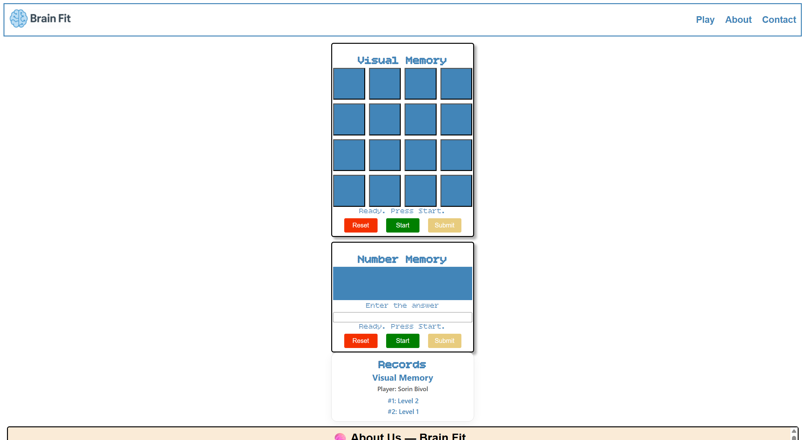
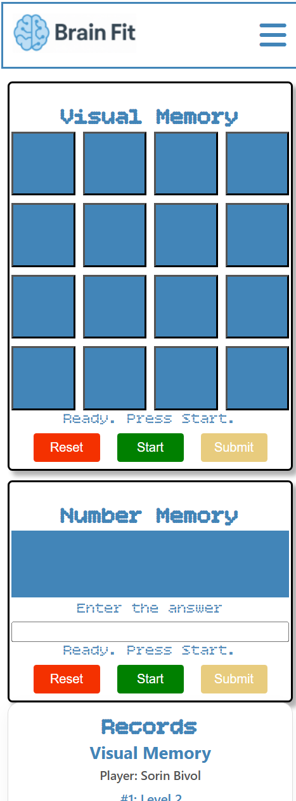
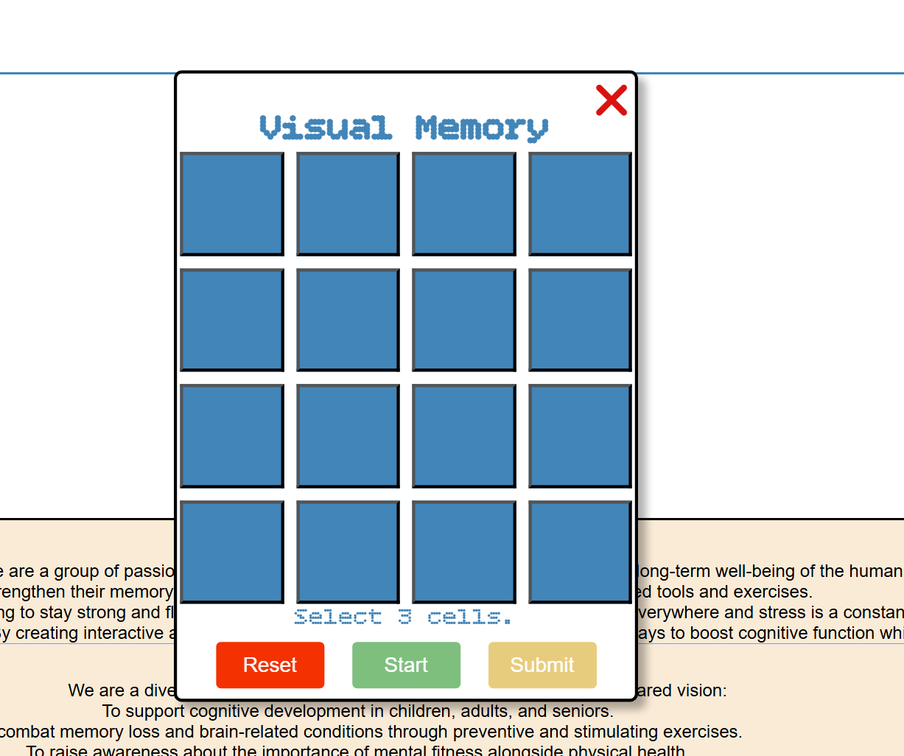
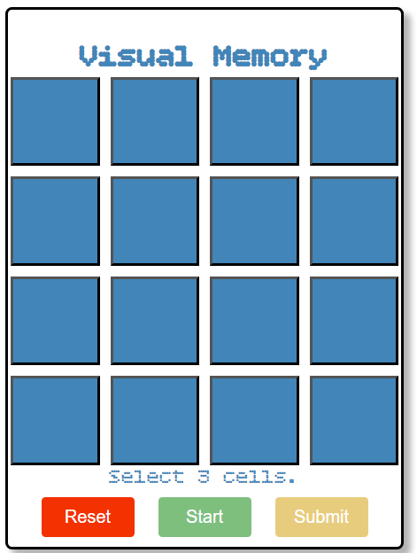
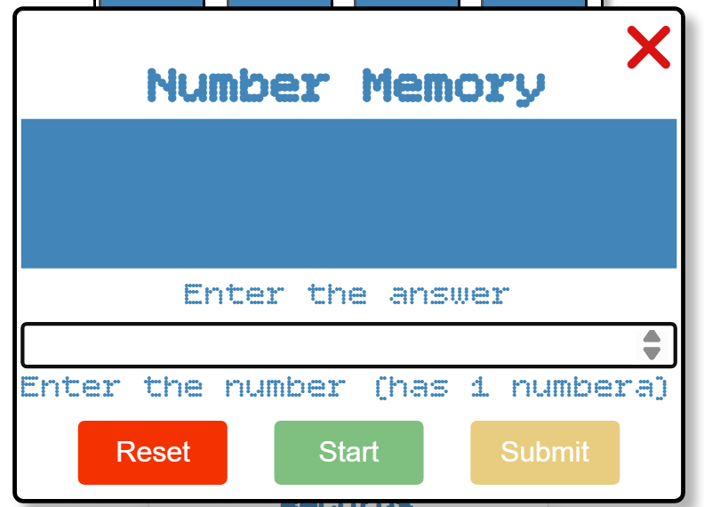
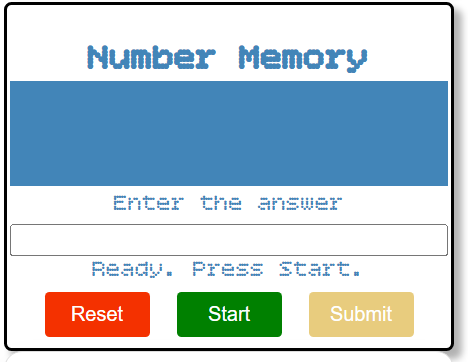
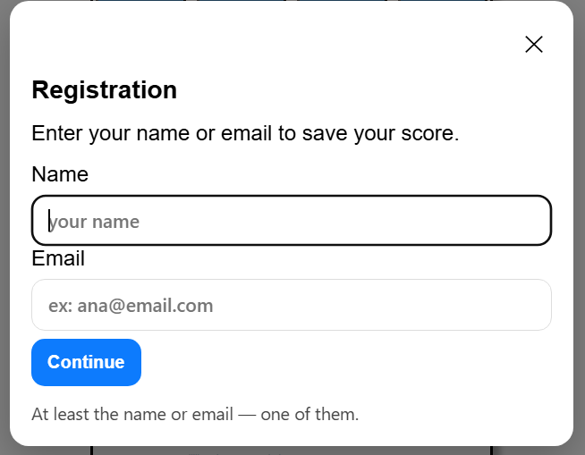

# Brain-Fit
Website for visual memory training and cognitive skills development

# Brain Fit – Interactive Memory Games

## Project Overview

**Brain Fit** is an interactive web application that challenges the user’s short-term memory through two mini-games:  
🧠 **Visual Memory** and 🔢 **Number Memory**.  

Players can sign in using a simple form (name or email), and their best scores are saved locally using **localStorage**.  
This project was created as part of the **Code Institute Full-Stack Developer Program**, showcasing front-end interactivity using **HTML, CSS, and JavaScript**.

Live site: [Add your deployed GitHub Pages link here]  
GitHub Repository: [Add your repository link here]

---

## Project Goals

### User Goals
- Play simple and engaging games that test visual and numerical memory.  
- See progress and top scores over time.  
- Access the games quickly without complex registration.  
- Enjoy an accessible and responsive design that works on any device.

### Site Owner Goals
- Provide a fun and educational platform that demonstrates interactive JavaScript skills.  
- Implement data storage (localStorage) for saving user progress.  
- Showcase clean code, accessibility, and responsiveness.

---

## UX Design

### Screenshots

Below are some screenshots of the live project:

#### Home Page



#### Visual Memory Game



#### Number Memory Game


#### Authentication Modal



### Strategy
The main goal of this site is to help users train their memory while providing immediate feedback and score tracking.

### Target Audience
- Students and professionals who want to improve focus and working memory.  
- People interested in short, fun brain-training games.  
- Users who prefer not to register with personal credentials.

### User Stories
1. As a user, I want to start a game easily so I can play without confusion.  
2. As a user, I want to log in with minimal information to keep my scores saved.  
3. As a user, I want to see my best scores for motivation and progress tracking.  
4. As a user, I want feedback after each round to understand my performance.  
5. As a user, I want the interface to be responsive and accessible.

---

## Design

### Colour Scheme
- Background: dark gradient for eye comfort.  
- Buttons and highlights: soft blue and yellow tones for focus and readability.  
- Visual feedback: green for correct, red for incorrect, light grey for neutral.

### Typography
- **Open Sans** – used for readability across all devices.  
- **Bitcount Grid Single** – used for game headers and highlights to give a tech-like feel.

### Imagery
No external images are required; all elements are generated with HTML and CSS to keep the project lightweight.

### Layout
- **Header** with navigation menu (burger toggle on mobile).  
- **Main Section** with game containers: Visual Memory and Number Memory.  
- **Aside Panel** displaying user info and top scores.  
- **Modal** for user sign-in (name/email).  
- **Footer** with author information and credits.

---

## Features

### Existing Features
- **Visual Memory Game**  
  - User must memorize highlighted squares and repeat the pattern.  
  - The grid increases in size every 7 levels.  
  - Feedback: correct/incorrect messages, level tracking.  

- **Number Memory Game**  
  - User must memorize a number shown briefly.  
  - Each level adds one more digit.  
  - Instant feedback and automatic difficulty scaling.

- **Authentication Modal**  
  - Simple registration form using only name or email.  
  - Prevents game start until user is identified.  
  - User is remembered automatically in future sessions.

- **Scoreboard Panel**  
  - Shows top 3 scores and best level per game.  
  - Updates dynamically after each round.  
  - Switches between games automatically.

- **Responsive Design**  
  - Fully playable on mobile, tablet, and desktop.  
  - Adaptive grid sizes and layout scaling.

- **Accessibility Enhancements**  
  - `aria-live` used for dynamic status messages.  
  - Clear focus outlines and keyboard navigation.

---

## Future Features

- Global leaderboard using a backend database (e.g., Firebase).  
- Profile customization (avatar, color theme).  
- Difficulty settings for timing and grid size.  
- Sound effects for correct/incorrect answers.  
- Option to export and import scores.

---

## Technologies Used

- **HTML5** – page structure and semantic layout.  
- **CSS3** – styling, grid layouts, responsiveness.  
- **JavaScript (ES6)** – logic for both games, authentication, and score saving.  
- **LocalStorage API** – stores player data and scores locally in the browser.  
- **Google Fonts** – Open Sans and Bitcount Grid Single.  
- **Font Awesome** – for minimalistic icons.

---

## Data Model

Player data is stored locally in the browser using JSON:

```json
{
  "email:john@example.com": {
    "id": "email:john@example.com",
    "name": "John",
    "records": {
      "visualMemory": { "highLevel": 7, "top": [7, 6, 5] },
      "numberMemory": { "highLevel": 5, "top": [5, 4, 3] }
    }
  }
}
